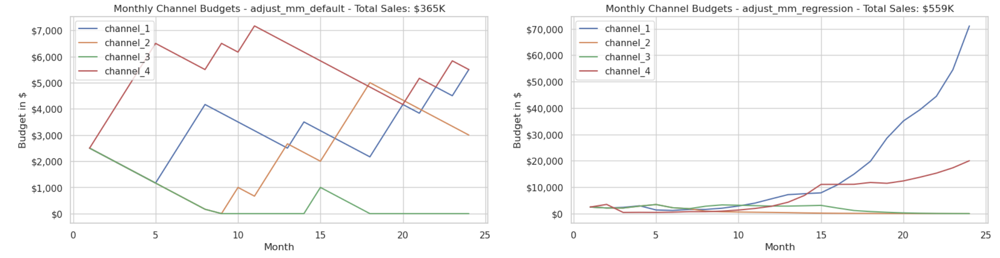

## MM Simulator
Marketing Mix data generator for testing attribution and MM models with pre-determined features. 

### Purpose
The MM channel and sales history data generator is meant to facilitate rapid prototyping and testing of different MM analytics  in a controlled environment. User can configure correlations, interactions, missing or confounding variables and rich sales history and persona data to use as hooks for time series /causal inference analytics. (The sales and persona dimensions are not yet included in the current codebase.)


### Example use
The framework provides services for:
* MM data generation based on configuration files 
* Execution hooks for user-provided attribution logic to influence MM
* Simulation of revenue accumulation based on different logic choises for attribution
* Final results evaluation and visualization 

To test a specific attribution and MM logic, the user will write a python function with this signature:

```python
def adjust_mm_<logic name>(mm_list: MarketingMonth, channels: List, current_month: int, total_budget: int) -> dict:
```

* MarketingMonth - A list of MarketingMonth instances representing all budgets, monthly sales and MM updates so far. So the adjust_mm function has all the information available at the point of time when it is being evaluated during the simulatoin.  
* channels - list of pre-defined marketing channels. 
* current_month - The current month within the simulation
* total_budget - Budget availabe to be shared among the marketing channels. 

Example implementation for rule-based logic attributing to the first matched channel and increasing its budget by 10%:

```python
def adjust_mm_default(mm_list, channels, current_month, total_budget):
    channel_to_increase = mm_list[-1].channel_flags[0][0]
    adjustment = total_budget * 0.10
    adjusted_budgets = {ch: mm_list[-1].channel_budgets[ch] - adjustment / (len(channels) - 1) if ch != channel_to_increase else mm_list[-1].channel_budgets[ch] + adjustment for ch in channels}
    return {ch: max(0, budget) for ch, budget in adjusted_budgets.items()}
```

### Model comparison
At the end of the simulation, the models and strategies can be visualized and compared in multiple ways. The charts below show a simple comparison of a first-channel and simple regression based strategy with 24 month simulation:




### Roadmap
* Data model enrichment - add personas and buyer dimensions
* Simulation configuration and iteration of copies to aggregate accross simulations. 
* Visualization and reporting completion
* Reference models and logic
* Causality examples
* Time series examples


